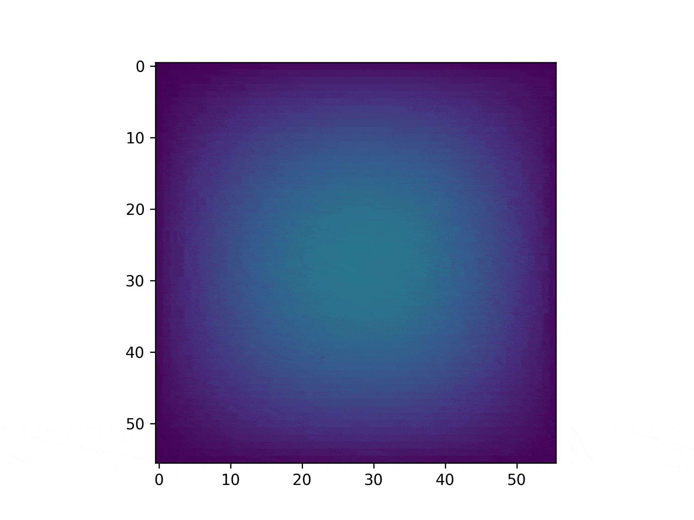

=============
[](https://codecov.io/gh/PolymerGuy/recolo)
[](https://circleci.com/gh/PolymerGuy/recolo)
[![MIT License][license-shield]][license-url]
[](https://recolo.readthedocs.io/en/latest/?badge=latest)
[](https://doi.org/10.21105/joss.03980)


About this project
------------------
In experimental mechanics, measuring the pressure load acting on a surface in a non-intrusive manner is of high interest for several applications. However, techniques allowing for such non-intrusive measurements have not been freely available to the experimental mechanics community.

**RECOLO** provides tools for reconstructing distributed pressure loads acting on thin, elastic plates. The Python package implements the virtual fields method (VFM), where the input is the kinematic fields governing the plate dynamics.

A virtual lab is also provided, allowing synthetic data to be generated based on input from finite element simulations.

Example kinematic fields pressure is shown below:


which gives the following pressure field:


The documentation is hosted at https://recolo.readthedocs.io/en/latest/


Getting Started
---------------
Clone the repo by using `git`:

```bash
git clone https://github.com/PolymerGuy/recolo.git
```

when in the folder with the repo, make a virtual environment and install all dependencies:

```bash
# Make virtual environment using venv
python -m venv env
# Activate the virtual environment
source ./env/bin/activate
# Install dependencies
pip install -r requirements.txt
```

To check that everything is working, run all tests:
```bash
python -m pytest --pyargs recolo --cov=./
```


Building the documentation from source
--------------------------------------
```bash
# Enter the documentation folder
cd docs
# Rebuild docs
make html
```

The documentation is now found in ./_build_/html


How to contribute
-----------------
The RECOLO project welcomes your expertise and enthusiasm!

You are more than welcome to contribute to this project, e.g., by:
* Report a bug using the Github issue tracker.
* Fix an already reported bug via a pull-request.
* Add new functionality via a pull-request.
* Help revise pull-requests.

When you wish to submit new or revised code, we encourage the following procedure:

* Fork the repo
* Implement your changes/additions
* Make a pull-request to the -dev branch

How to cite us
--------------
If you use this toolkit in your scientific work, consider citing one or more of the following:

- S. N. Olufsen, R. Kaufmann, E. Fagerholt, V. Aune (2022). RECOLO: A Python package for the reconstruction of surface pressure loads from kinematic fields using the virtual fields method. Journal of Open Source Software, 7(71), 3980, https://doi.org/10.21105/joss.03980


[license-shield]: https://img.shields.io/badge/license-MIT-blue.svg?style=flat-square
[license-url]: https://choosealicense.com/licenses/mit
