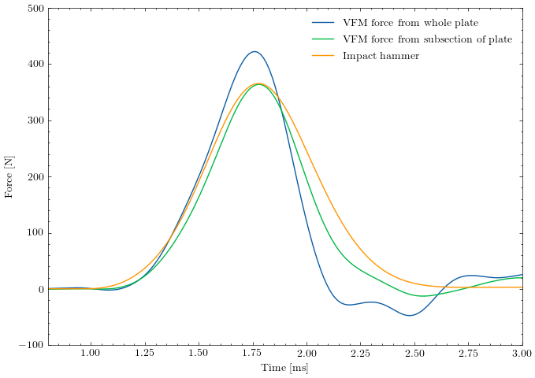

Experiment with impact hammer
=============================

This example presents the force reconstruction from an experiment where an impact hammer is used to knock on a steel plate.
The force from the hammer onto the plate is reconstructed from the kinematics fields  measured by deflectometry.

Due to the large size of the data set, the data is hosted on https://dataverse.no/ and can either be downloaded manually
or using this toolkit.

Let's now go through the necessary steps for force reconstruction based on deflectometry.
First, we need to import the Recolo toolkit::

    import recolo

The experimental data is conveniently downloaded and accessed via the ImpactHammerExperiment class::

    exp_data = recolo.demoData.ImpactHammer()

After the download has completed, the force measurements can be accessed as::

    hammer_force, hammer_time = exp_data.hammer_data()

The experiment was performed on a 300 x 300 mm rectangular plate with the following properties::

     mat_E = 190.e9  # Young's modulus [Pa]
     mat_nu = 0.3  # Poisson's ratio []
     density = 7934
     plate_thick = 4.95e-3

The stiffness of the plate is calculated as::

     plate = recolo.make_plate(mat_E, mat_nu, density, plate_thick)

The experimental setup has to be described by::

    grid_pitch = 7.0  # pixels
    grid_pitch_len = 2.5 / 1000.  # m
    mirror_grid_distance = 1.63  # m
    pixel_size_on_mirror = grid_pitch_len / grid_pitch * 0.5

We now set the pressure reconstruction window size::

     win_size = 30

as well as filter and downsampling settings::

     downsampling_factor = 5
     filter_time_sigma = 6
     filter_space_sigma = 2

In this case, the deflection fields from Abaqus are used to generate grid images with the corresponding distortion.
The grid images are then used as input to deflectomerty and the slope fields of the plate are determined::

    slopes_y, slopes_x = recolo.deflectomerty.slopes_from_images(exp_data.path_to_img_folder, grid_pitch,
                                                             mirror_grid_distance, pixel_size_on_grid_plane,
                                                             ref_img_ids=ref_img_ids,
                                                             only_img_ids=use_imgs,
                                                             crop=(76, -35, 10, -10), window="triangular",
                                                             correct_phase=False)

The slope fields are then integrated to determine the deflection fields::

     # Integrate slopes to get deflection fields
     disp_fields = recolo.slope_integration.disp_from_slopes(slopes_x, slopes_y, pixel_size,
                                                            zero_at="bottom corners", zero_at_size=5,
                                                            extrapolate_edge=0, downsample=downsampling_factor)

Based on these fields, the kinematic fields (slopes and curvatures) are calculated::

     kin_fields = recolo.kinematic_fields_from_deflections(disp_fields, downsampling_factor * pixel_size_on_mirror, sampling_rate,
                                                       filter_time_sigma=filter_time_sigma)

Now, the pressure reconstuction can be initiated. First we define the Hermite16 virtual fields::

     virtual_field = recolo.virtual_fields.Hermite16(win_size, pixel_size_on_mirror)

and initialize the pressure reconstruction::

     times = []
     presses = []

     for i, field in enumerate(kin_fields):
          recon_press = recolo.solver_VFM.calc_pressure_thin_elastic_plate(field, plate, virtual_field)
          presses.append(recon_press)
          times.append(field.time)

     presses = np.array(presses)

The results can then be visualized::

     center = int(presses.shape[1] / 2)

     # Plot the results
     plt.figure(figsize=(7,5))
     plt.plot(times, np.sum(presses, axis=(1, 2)) * ((pixel_size_on_mirror * downsampling_factor) ** 2.), label="VFM force from whole plate")
     plt.plot(times, np.sum(presses[:,20:50,20:50], axis=(1, 2)) * ((pixel_size_on_mirror * downsampling_factor) ** 2.), label="VFM force from subsection of plate")
     plt.plot(hammer_time, hammer_force, label="Impact hammer")
     plt.xlim(left=0.0008, right=0.003)
     plt.ylim(top=500, bottom=-100)
     plt.xlabel("Time [ms]")
     plt.ylabel(r"Force [N]")

     plt.legend(frameon=False)
     plt.tight_layout()
     plt.show()

The resulting plot looks like this:

A few things should be noted:
     * The force level is highly sensitive to the area over which the pressure is integrated.
     * The deviations are believed to be caused by interaction between deflection at the position of the hammer and the boundary conditions.
     * Filtering does have an influence on the force amplitude, but relatively large filter kernels can be used without decreasing the force level.

