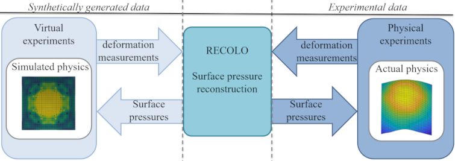

Overview
========
**RECOLO** provides tools for reconstructing the pressure field acting on a plate based on
the corresponding deformation measurements. The tools allow the user to perform virtual experiments on synthetically generated data as well as performing pressure reconstruction on experimental datasets of full-field deformation measurements (See figure below).

Currently, this tool is limited to small elastic deformations, but will be extended to
large plastic deformations in the future. In order to assess the capabilities of this toolkit, a suite of tools
for performing virtual experiments are provided. The tools allow the user to generate synthetic input for the load
reconstruction based on the results from finite element simulations, providing strict control over all aspects of the imposed loading
(spatial and temporal variations) as well as experimental aspects such as signal-to-noise ratio. The synthetic data is also a powerful tool for testing of the toolkit, facilitating adoption, development and validation.

The toolkit can be seen as two complementary parts with the following functionality:

* Tools for determining the dynamic pressure field acting on a thin plate based on deformation measurements
    * In-plane deformation measurements using "the grid method"
    * Slope and deflection measurements using deflectometry
    * Controlling the signal-to-noise ratio using a variety of filters
    * Pressure reconstruction using the virtual fields method
* Tools for generating synthetic input based on dynamic finite element simulations of plates subjected to arbitrary pressure fields.
    * Parser for the finite element suite Abaqus
    * Artificial grid deformation for generating images for deflectometry

Getting started
---------------
To install the toolkit, please see :doc:`install`

For a quick start showing just the pressure reconstruction, see :doc:`quickstart`

For a full examples including generation of synthetic data, please see :doc:`deflectometryAbaqus`.

For a full examples on an experimental dataset, please see :doc:`impactHammer`.

For examples showing how to set up other synthetic experiments with various level of detail,
please see the examples available on Github  https://github.com/PolymerGuy/recolo/tree/master/examples

The individual components of the toolkit can be browsed in the API-documentation.