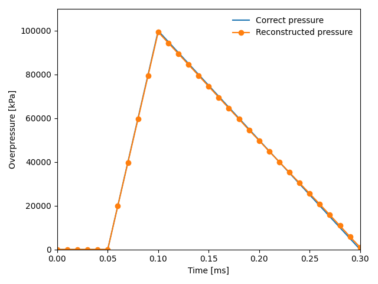

Minimal example
===============

Let's now go through the necessary steps for doing pressure reconstruction.
First, we need to import the tools::

     import recon
     import numpy as np

The example data can be downloaded from the recon/examples/AbaqusExamples/AbaqusRPTs folder. 
The dataset corresponds to a 300 x 300 mm  thin plate exposed to a sinusoidal pressure distribution in space and a saw-tooth shaped history in time.
::

     mat_E = 210.e9  # Young's modulus [Pa]
     mat_nu = 0.33  # Poisson's ratio []
     density = 7700
     plate_thick = 5e-3
     plate = recon.make_plate(mat_E, mat_nu, density, plate_thick)
     

We now set the pressure reconstuction window size. 
Note that as we here use noise free data on a relatively coarse dataset, a very small window size is used::

     win_size = 6

We now load Abaqus data::

     abq_sim_fields = recon.load_abaqus_rpts("path_to_abaqus_data"))

The Abaqus data contains the out-of-plane deflection and acceleration at each node of the plate for every time step.
Based on these fields, the kinematic fields (slopes and curvatures) are calculated. By default the accelerations are determined from the 
deflection fields directly, but we here choose to use the acceleration fields from Abaqus. This is done by setting the keyword argument "acceleration_field".
::

     kin_fields = recon.kinematic_fields_from_deflections(abq_sim_fields.disp_fields, 
                                                            abq_sim_fields.pixel_size_x,
                                                            abq_sim_fields.sampling_rate,
                                                            acceleration_field=abq_sim_fields.accel_fields)

Now, the pressure reconstuction can be initiated. First we define the Hermite16 virtual fields::

     virtual_field = recon.virtual_fields.Hermite16(win_size, abq_sim_fields.pixel_size_x)

and initialize the pressure reconstruction::

     pressure_fields = np.array(
     [recon.solver_VFM.pressure_elastic_thin_plate(field, plate, virtual_field) 
                                                      for field in kin_fields])

The results can then be visualized::

     import matplotlib.pyplot as plt
     # Plot the correct pressure in the center of the plate
     times = np.array([0.0, 0.00005, 0.00010, 0.0003, 0.001]) * 1000
     pressures = np.array([0.0, 0.0, 1.0, 0.0, 0.0]) * 1e5
     plt.plot(times, pressures, '-', label="Correct pressure")

     # Plot the coreconstructed pressure in the center of the plate
     center = int(pressure_fields.shape[1] / 2)
     plt.plot(abq_sim_fields.times * 1000., pressure_fields[:, center, center], "-o",label="Reconstructed pressure")

     plt.xlim(left=0.000, right=0.3)
     plt.ylim(top=110000, bottom=-15)
     plt.xlabel("Time [ms]")
     plt.ylabel(r"Overpressure [kPa]")

     plt.legend(frameon=False)
     plt.tight_layout()
     plt.show()

The resulting plot looks like this:

